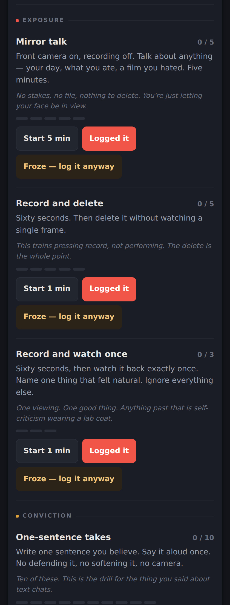

# Camera Confidence

An interactive on-camera training program for people starting at zero.

**[Open `index.html`](index.html)** — self-contained, offline, saves progress in your browser.

## Why this exists

Freezing on camera usually gets treated as one problem: you're not used to being filmed.
But plenty of people who freeze on camera also hedge everything they write. That isn't
camera anxiety — it's not trusting your own take. The camera just makes it visible.

This program trains both at once. **Exposure** work gets you used to being seen.
**Conviction** work gets you used to having a position and holding it. Doing either alone
doesn't get you there.

## How it works

- **19 exercises across 5 stages**, counted in reps rather than weeks — a missed day is never a missed deadline
- **Built-in timers** for the timed drills, framed in viewfinder brackets
- **A froze button** — when you seize up, you log it anyway and it counts. Those entries collect in a log worth re-reading a month later
- **Nothing hard-locked** — later stages are marked "not yet" but open anyway

Start at Stage 0. It takes about ten minutes and you don't have to watch anything back.

## Install

No install. Download `index.html` and open it, or host it anywhere static.
Progress is stored in your own browser and never leaves your device.
